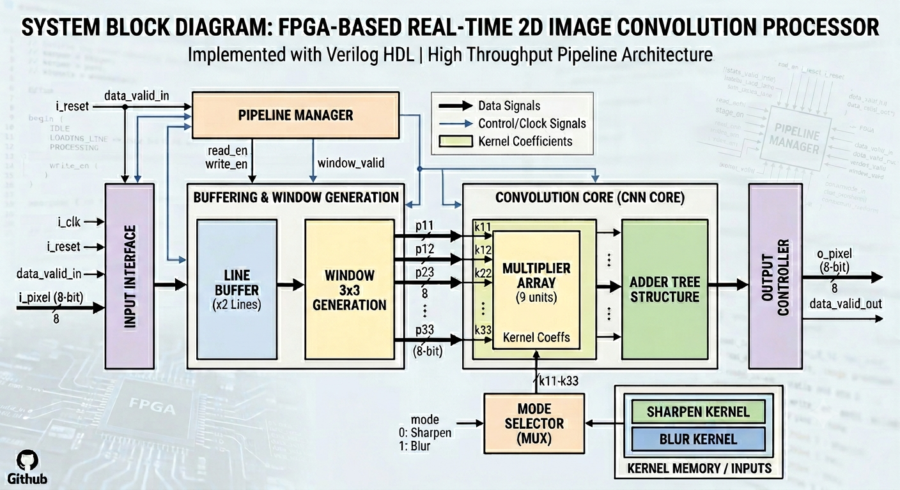
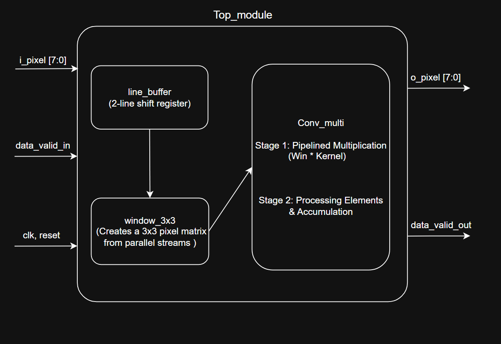
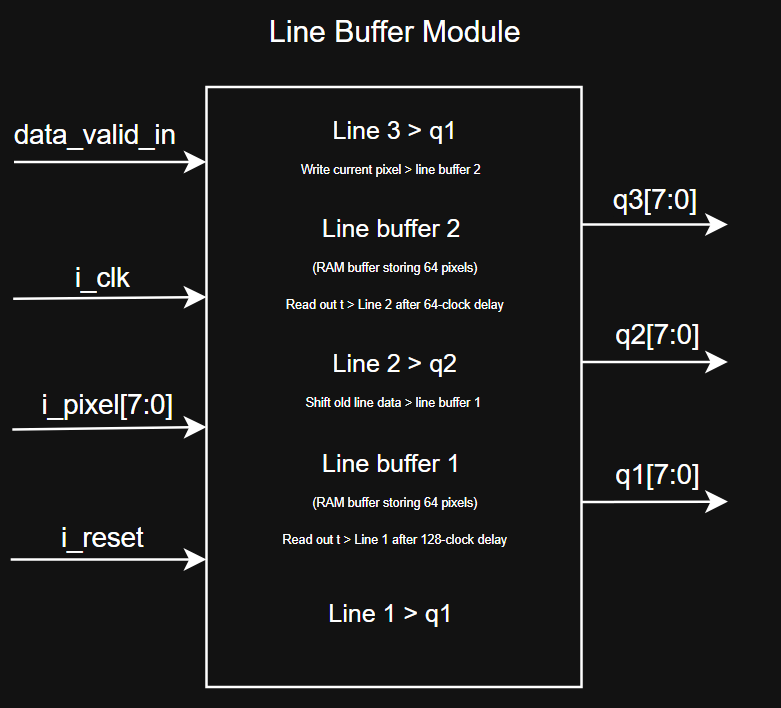
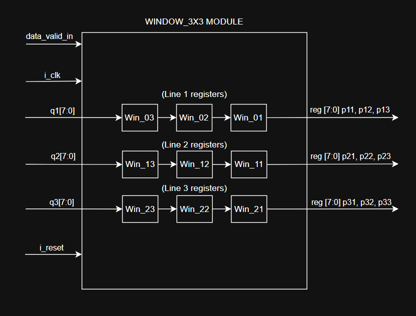
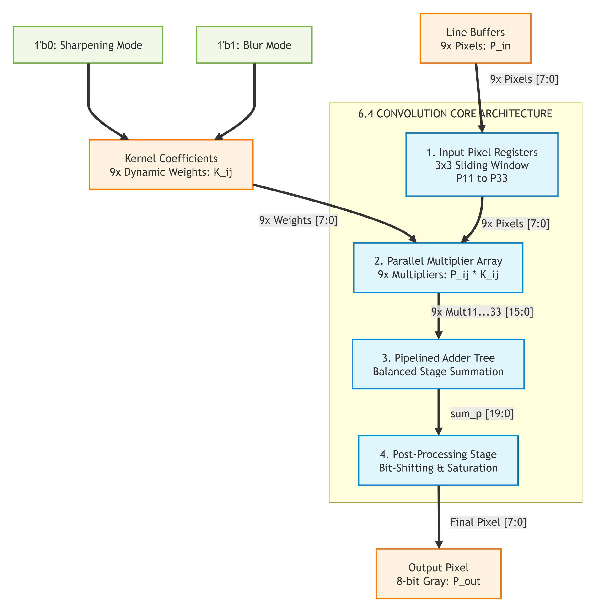
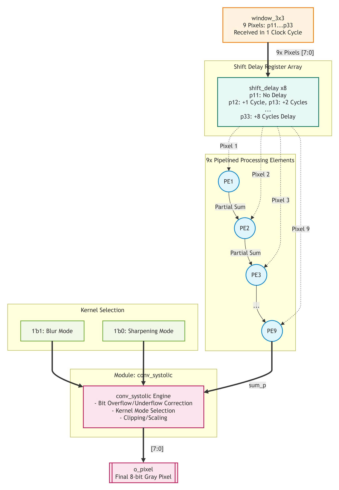

# FPGA_RealTime_Conv3x3_Processor

---

## 1. Project Description

This project implements a real-time image processor on an FPGA using a 3x3 Convolution algorithm to perform common image filters such as Blur and Sharpening. The convolution core — the part of the system responsible for accumulating the 9 multiply results of the 3x3 window — is implemented in **two alternative hardware architectures**:

1. **Adder Tree** (`conv_adder_tree.v`): all 9 multiply-accumulate terms are summed combinationally in a single clock cycle using a tree of adders.
2. **Systolic Array** (`conv_systolic.v` + `systolic_pe.v` + `shift_delay.v`): the same 9-term accumulation is broken into a chain of 9 Processing Elements (PE), each performing exactly one multiply and one add per clock cycle.

Both architectures are functionally equivalent (produce the same convolution result) but differ in critical path length, pipeline latency, and hardware resource usage — this trade-off is the central comparison of this project (see Section 8 onward).

### 1.2 Objective

- Understand how 3x3 convolution works and how it is implemented in RTL.
- Understand how a combinational adder tree accumulator works, and its critical-path limitation as kernel size grows.
- Understand how a systolic-array (single-MAC-per-stage) accumulator works, and how it trades latency for a shorter, size-independent critical path.
- Compare both architectures quantitatively — hardware resource usage (LUT/FF/DSP) and maximum clock frequency (Fmax) — using Vivado synthesis and implementation reports, across multiple image resolutions (64x64, 128x128, 256x256).

---

## Table of Contents

* [Project Description](#1-project-description)
* [System Overview](#2-system-overview)
* [General Block Diagram](#3-general-block-diagram)
* [Repository Structure](#4-repository-structure)
* [Module Index](#5-module-index)
* [Interface Specifications](#6-interface-specifications)
* [System Workflow](#7-system-workflow)
* [Experimental Results](#8-experimental-results)
* [Comparison & Trade-off Discussion](#9-comparison--trade-off-discussion)
* [Limitations](#10-limitations)
* [Future Work](#11-future-work)

---

## 2. System Overview

The system processes a grayscale image through a real-time streaming pipeline:

- **Input:** A grayscale image is converted into raw pixel data (`.hex`/`.txt`) using a Python preprocessing script. This data is streamed into the FPGA one pixel per clock cycle through `i_pixel`, gated by `data_valid_in`.
- **Buffering & Windowing:** The `line_buffer` module stores 2 previous rows of the image, and `window_3x3` combines them with the current pixel to form a 3x3 sliding window (`p11` to `p33`) at every clock cycle.
- **Convolution:** The 3x3 window is passed to the convolution core, which multiplies each pixel by its corresponding kernel coefficient (selected by the `mode` signal — Sharpen or Blur) and accumulates the 9 products into a single result. **This is the stage where the Adder Tree and Systolic Array architectures differ** — everything before and after this stage (`line_buffer`, `window_3x3`, output handling) is identical between both versions.
- **Output:** The resulting pixel is output through `o_pixel`, synchronized with `data_valid_out`. A Python postprocessing script reconstructs the output pixel stream back into a viewable image.

---

## 3. General Block Diagram



---

## 4. Repository Structure

```
FPGA_RealTime_Conv3x3_Processor/
├── src/
│   ├── common/
│   │   ├── line_buffer.v
│   │   └── window_3x3.v
│   ├── adder_tree/
│   │   ├── conv_adder_tree.v
│   │   └── top_module.v
│   └── systolic/
│       ├── shift_delay.v
│       ├── systolic_pe.v
│       ├── conv_systolic.v
│       └── top_module.v
├── constraints/
│   └── constraints.xdc
├── testbench/
│   └── testbench_prj.v
├── golden_model/
│   ├── golden_model.py
│   ├── compare_my_image.py
│   └── verification_logs/
│       ├── verification_log.csv
│       └── verification_log.txt
├── scripts/
│   ├── image_to_hex.py
│   └── hex_to_image.py
├── results/
│   ├── 64x64/
│   │   ├── adder_tree/
│   │   │   ├── top_module_utilization_synth_64x64.rpt
│   │   │   ├── input_data_64.hex
│   │   │   ├── output_sharp_64.hex
│   │   │   └── output_blur_64.hex
│   │   └── systolic/
│   │       ├── top_module_utilization_synth_64x64.rpt
│   │       ├── input_data_64.hex
│   │       ├── output_sharp_64.hex
│   │       └── output_blur_64.hex
│   ├── 128x128/
│   │   ├── adder_tree/
│   │   │   └── ...
│   │   └── systolic/
│   │       └── ...
│   ├── 256x256/
│       ├── adder_tree/
│       │   └── ...
│       └── systolic/
│           └── ...
├── image/
└── README.md
```

---

## 5. Module Index

| # | Module           | File               | Role                                                                                                        |
| --- | ---------------- | ------------------ | ----------------------------------------------------------------------------------------------------------- |
| 1 | `top_module`     | `top_module.v`     | The highest-level top module, connecting the entire system on the FPGA.                                     |
| 2 | `line_buffer`    | `line_buffer.v`    | Stores 2 lines of image data. Converts serial pixel data into a 3x3 matrix.                                  |
| 3 | `window_3x3`     | `window_3x3.v`     | Extracts a 3x3 pixel window (p11 to p33) from the Line Buffer to feed into the convolution core.             |
| 4 | `conv_adder_tree` | `conv_adder_tree.v` | Convolution core — **Adder Tree** architecture. Selects Sharpen/Blur kernel via `mode`, accumulates via a combinational adder tree. |
| 5 | `conv_systolic`  | `conv_systolic.v`  | Convolution core — **Systolic Array** architecture. Same interface as `conv_adder_tree`, accumulates via a chain of 9 Processing Elements. |
| 6 | `systolic_pe`    | `systolic_pe.v`    | A single Processing Element used by `conv_systolic`: performs one multiply and one add per clock cycle.      |
| 7 | `shift_delay`    | `shift_delay.v`    | Generic N-cycle delay utility, used by `conv_systolic` to align pixel/mode/valid timing across the PE chain. |
| 8 | `testbench_prj`  | `testbench_prj.v`  | Simulation testbench: loads images from Python, drives the DUT, and writes output data for verification.     |

---

## 6. Interface Specifications

### 6.1 `top_module`



| # | Gate             | Type   | Bit-width | Description                             |
| --- | ---------------- | ------ | --------- | ---------------------------------------- |
| 1 | `i_clk`          | Input  | 1-bit     | System clock signal                     |
| 2 | `i_reset`        | Input  | 1-bit     | Resets the entire circuit (active-high) |
| 3 | `i_pixel`        | Input  | 8-bit     | Input pixel data (grayscale)            |
| 4 | `data_valid_in`  | Input  | 1-bit     | Signals valid input data                |
| 5 | `mode`           | Input  | 1-bit     | Selects mode: 0 (Sharpen), 1 (Blur)     |
| 6 | `o_pixel`        | Output | 8-bit     | Processed pixel result                  |
| 7 | `data_valid_out` | Output | 1-bit     | Signals valid output data                |

### 6.2 `line_buffer`



| # | Gate      | Type   | Bit-width | Description                                             |
| --- | --------- | ------ | --------- | -------------------------------------------------------- |
| 1 | `i_clk`   | Input  | 1-bit     | System clock signal                                     |
| 2 | `i_reset` | Input  | 1-bit     | Resets the entire circuit (active-high)                 |
| 3 | `i_pixel` | Input  | 8-bit     | Input pixel data (grayscale) received from `top_module` |
| 4 | `q1`      | Output | 8-bit     | Current data                                            |
| 5 | `q2`      | Output | 8-bit     | Previous line data (delayed by 1 line)                  |
| 6 | `q3`      | Output | 8-bit     | Data from 2 lines ago (delayed by 2 lines)              |

### 6.3 `window_3x3`



| # | Gate             | Type  | Bit-width | Description                             |
| --- | ---------------- | ----- | --------- | ---------------------------------------- |
| 1 | `i_clk`          | Input | 1-bit     | System clock signal                     |
| 2 | `i_reset`        | Input | 1-bit     | Resets the entire circuit (active-high) |
| 3 | `q1`, `q2`, `q3` | Input | 8-bit     | Input data from 3 lines (Line Buffer)   |
| 4 | `data_valid_in`  | Input | 1-bit     | Signals valid input data                |
| 5 | `p11...p33`      | Output | 8-bit(x9) | 9 pixels forming the 3x3 window matrix  |

### 6.4 Convolution Core

The convolution core is the only stage that differs between the two architectures compared in this project. Both versions share the exact same external interface (`i_clk`, `i_reset`, `data_valid_in`, `mode`, `p11...p33` → `o_pixel`, `data_valid_out`), so either can be instantiated in `top_module.v` without changing any other module.

#### 6.4.1 Adder Tree — `conv_adder_tree.v`



| # | Gate             | Type   | Bit-width | Description                                      |
| --- | ---------------- | ------ | --------- | -------------------------------------------------- |
| 1 | `i_clk`          | Input  | 1-bit     | System clock signal                              |
| 2 | `i_reset`        | Input  | 1-bit     | Resets the entire circuit (active-high)          |
| 3 | `data_valid_in`  | Input  | 1-bit     | Signals valid input data                         |
| 4 | `mode`           | Input  | 1-bit     | Selects kernel: 0 (Sharpen), 1 (Blur)            |
| 5 | `p11...p33`      | Input  | 8-bit(x9) | Inputs the 3x3 pixel matrix into the convolution |
| 6 | `o_pixel`        | Output | 8-bit     | Outputs 1 pixel after convolution (mode-selected) |
| 7 | `data_valid_out` | Output | 1-bit     | Signals valid output data                        |

**How it works:** all 9 multiply results (`pixel × kernel coefficient`) are computed in parallel in one register stage, then summed together in a single combinational adder tree in the next stage, then clipped/scaled in a final stage. Total pipeline latency: **3 clock cycles**.

#### 6.4.2 Systolic Array



**How it works:** instead of summing all 9 terms in one cycle, the accumulation is broken into a chain of 9 Processing Elements (PE). Each PE performs exactly one multiply and one add per clock cycle, then registers the partial sum before passing it to the next PE. Because a new 3x3 window arrives every clock cycle (not every 9 cycles), each pixel/mode/valid signal must be delayed by an amount matching its position in the chain (handled by `shift_delay.v`) so that every PE always operates on data from the *same* window. Total pipeline latency: **10 clock cycles** (9 PE stages + 1 final output/clipping stage).

##### 6.4.2.1 `conv_systolic.v`


| # | Gate             | Type   | Bit-width | Description                                      |
| --- | ---------------- | ------ | --------- | -------------------------------------------------- |
| 1 | `i_clk`          | Input  | 1-bit     | System clock signal                              |
| 2 | `i_reset`        | Input  | 1-bit     | Resets the entire circuit (active-high)          |
| 3 | `data_valid_in`  | Input  | 1-bit     | Signals valid input data                         |
| 4 | `mode`           | Input  | 1-bit     | Selects kernel: 0 (Sharpen), 1 (Blur)            |
| 5 | `p11...p33`      | Input  | 8-bit(x9) | Inputs the 3x3 pixel matrix into the convolution |
| 6 | `o_pixel`        | Output | 8-bit     | Outputs 1 pixel after convolution (mode-selected) |
| 7 | `data_valid_out` | Output | 1-bit     | Signals valid output data                        |

##### 6.4.2.2 `systolic_pe.v`


| # | Gate                 | Type   | Bit-width         | Description                                                        |
| --- | -------------------- | ------ | ----------------- | -------------------------------------------------------------------- |
| 1 | `i_clk`              | Input  | 1-bit             | System clock signal                                                |
| 2 | `i_reset`            | Input  | 1-bit             | Resets the entire circuit (active-high)                            |
| 3 | `i_pixel`            | Input  | 8-bit             | 1 pixel of the 3x3 window, pre-delayed to align with this PE's stage |
| 4 | `i_weight`           | Input  | 8-bit (signed)    | Kernel coefficient corresponding to this PE's position              |
| 5 | `i_valid`            | Input  | 1-bit             | Local valid signal, pre-delayed to align with this PE's stage       |
| 6 | `i_partial_sum_in`   | Input  | 20-bit (signed)   | Partial sum accumulated from the previous PE in the chain           |
| 7 | `o_partial_sum`      | Output | 20-bit (signed)   | Partial sum after adding this PE's multiply result (registered)      |

##### 6.4.2.3 `shift_delay.v`


| # | Gate       | Type   | Bit-width       | Description                                          |
| --- | ---------- | ------ | --------------- | ------------------------------------------------------ |
| 1 | `i_clk`    | Input  | 1-bit           | System clock signal                                  |
| 2 | `i_reset`  | Input  | 1-bit           | Resets the entire circuit (active-high)              |
| 3 | `i_data`   | Input  | `WIDTH`-bit      | Signal to be delayed                                 |
| 4 | `o_data`   | Output | `WIDTH`-bit      | `i_data` delayed by `DEPTH` clock cycles (parameter)  |

---

## 7. System Workflow

### 1. Input Stage

- **Preprocessing (Python):** The original image is converted into an 8-bit pixel value matrix (0–255) using `image_to_hex.py`, saved to `input_data.hex`.
- **Data Loading:** During simulation (`testbench_prj.v`), this `.hex` file is read and pushed pixel-by-pixel into `i_pixel` at every rising edge of `i_clk`.

### 2. Processing Stage

- **Data Buffering:** `line_buffer.v` receives single pixels and shifts them through register stages to form 2 line buffers.
- **3x3 Window Generation:** `window_3x3.v` combines line buffer data with the current pixel to extract the 3x3 window (`p11` to `p33`).
- **Convolution Calculation:** The 3x3 window is sent to the convolution core (either `conv_adder_tree.v` or `conv_systolic.v`, depending on which architecture is instantiated in `top_module.v`), which selects the kernel coefficients based on `mode` and accumulates the result.

### 3. Output Stage

- **Synchronization:** `data_valid_out` is asserted to indicate `o_pixel` is ready.
- **Postprocessing (Python):** `output_data.hex` is read by `hex_to_image.py` and reconstructed into a viewable image.

---

## 8. Experimental Results

### 8.1 Timing Methodology

Fmax is derived from Vivado's Timing Summary report after implementation, using:

```
Fmax = 1 / (Clock Period − WNS)
```

where **WNS (Worst Negative Slack)** is read directly from the Design Timing Summary. The same clock constraint file (`constraints.xdc`, 5.500 ns period) was used across all image sizes and both architectures, so the resulting Fmax values are directly comparable.

### 8.2 Adder Tree (`conv_adder_tree.v`)

| Image Size | LUT | FF | DSP | WNS (ns) | Fmax (MHz) |
|---|---|---|---|---|---|
| 64x64   | 201 | 259 | 1 | 0.150  | 186.9 |
| 128x128 | 233 | 323 | 1 | 0.116  | 185.7 |
| 256x256 | 297 | 451 | 1 | -0.002 | 181.75 |

Pipeline Latency: **3 clock cycles** (fixed, independent of image size)

### 8.3 Systolic Array (`conv_systolic.v`)

| Image Size | LUT | FF | DSP | WNS (ns) | Fmax (MHz) |
|---|---|---|---|---|---|
| 64x64   | 579 | 478 | 1 | 0.133  | 186.3 |
| 128x128 | 611 | 542 | 1 | -0.013 | 181.4 |
| 256x256 | 671 | 670 | 1 | 0.037  | 183.05 |

Pipeline Latency: **10 clock cycles** (fixed, independent of image size)

---

## 9. Comparison & Trade-off Discussion

### Adder Tree
- Fewer LUT/FF than Systolic Array at every tested image size — no pixel-alignment shift-registers needed.
- Lowest pipeline latency (3 cycles), independent of image size.
- Fmax stays close to the Systolic Array's at every size (see note below).

### Systolic Array
- More LUT/FF than Adder Tree — mainly from the `shift_delay` chains needed to align each of the 9 pixels with its position in the PE chain.
- Higher latency (10 cycles) — a deliberate trade-off for a shorter, size-independent critical path per stage.
- Fmax stays close to the Adder Tree's at every size (see note below).
- **The relative LUT/FF overhead shrinks as image size grows** — 2.88×/1.85× at 64x64, down to 2.62×/1.68× at 128x128, and 2.26×/1.49× at 256x256 (Systolic vs Adder Tree). This is expected: the `shift_delay` alignment chains are sized by the *kernel* (fixed at 9 positions), not by image size, while `line_buffer`'s cost — shared by both architectures — grows with image width. As image size increases, this common, growing cost dilutes the fixed overhead that is unique to the Systolic Array.

> **Note — why Fmax is nearly identical:** both cores share the same final blur stage (`sum × 114 >>> 10`), which is likely the true critical path — not the summation that differs between the two designs. At a 3x3 kernel, the Adder Tree's summation (4 addition levels) is already fast enough that shortening it via the Systolic Array gives no measurable Fmax gain. This may change at larger kernels (5x5, 7x7), where the deeper Adder Tree summation could dominate the critical path instead.

---

## 10. Limitations

- Verified via RTL simulation and Vivado synthesis/implementation reports only; not yet deployed on physical FPGA hardware (no on-board Fmax/power measurement).
- Kernel coefficients are hardcoded per mode (chosen via a `case`/mux internally); not yet runtime-configurable through a register interface.
- Tested on grayscale images only; RGB is not yet supported.
- The pipeline has no explicit "image boundary" handling: the first ~2 rows of pixels are computed while the internal line buffers are still filling with reset (zero) values.
- Fmax figures are derived from Vivado's static timing analysis (post-implementation), not measured on physical silicon; actual on-board Fmax may differ slightly due to temperature/voltage/process variation.

---

## 11. Future Work

- Gaussian Filter and Sobel Edge Detection support in both convolution core architectures.
- Runtime-configurable convolution kernel (coefficients loaded via a register interface).
- Extending the comparison to larger kernel sizes (5x5, 7x7) to observe how the Fmax gap between Adder Tree and Systolic Array grows with kernel size.
- RGB image support.
- Deployment on physical FPGA hardware with on-board Fmax and power measurement.
- AXI4-Stream wrapper for integration into larger SoC / camera-pipeline systems.